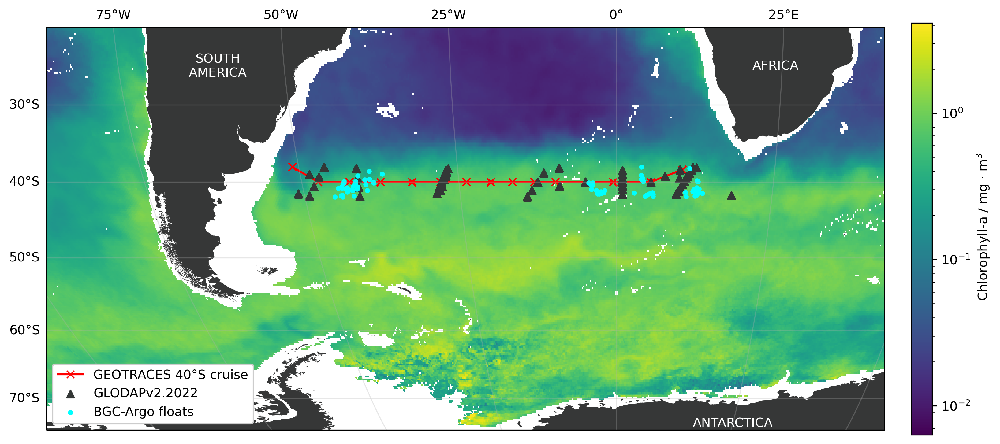

# The Changing Biological Carbon Pump of the South Atlantic Ocean

This repository includes the raw data and scripts used to analyze and plot this data for the study:

**The Changing Biological Carbon Pump of the South Atlantic Ocean**

*L. Delaigue1\*, O. Sulpis2,3, G-J Reichart1,3 and M. P. Humphreys1*

1Department of Ocean Systems (OCS), NIOZ Royal Netherlands Institute for Sea Research, PO Box 59, 1790 AB Den Burg (Texel), the Netherlands  
2CEREGE, Aix Marseille Univ, CNRS, IRD, INRAE, Collège de France, Aix-en-Provence, France  
3Department of Earth Sciences, Utrecht University, Utrecht, the Netherlands

*Corresponding author: Louise Delaigue ([louise.delaigue@nioz.nl](mailto:louise.delaigue@nioz.nl))*

## There are three main folders:
**GLODAP**  
   Includes Python scripts to process and prepare GLODAPv2.2022 data for analysis. Due to the large size of the GLODAP file, it is excluded from this repository and listed in the `.gitignore` file. You will need to download it directly from [GLODAP's official website](https://www.glodap.info).
   
**ARGO**  
   Includes Python scripts to process and prepare BGC-Argo data for analysis. Due to the large size of the files, bathymetry and chl-a data are excluded from this repository and listed in the `.gitignore` file. You will need to download it directly from the [CMEMS Marine Data Store](https://data.marine.copernicus.eu/product/MULTIOBS_GLO_BIO_BGC_3D_REP_015_010/description) and the [GEBCO's official website](https://download.gebco.net/).

**ANALYSIS**  
   Includes Python scripts, in order, to calculate the change in each variable from the combined dataset, propagate uncertainty, and plot the rates of change in each estimate of the soft tissue pump, carbonate pump, and anthropogenic component.
